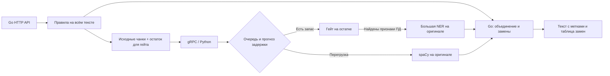

# alpha_proxy

Сервис находит персональные данные в русскоязычном тексте, заменяет их на метки
вроде `<FULL_NAME_1>` и `<PHONE_1>` и восстанавливает исходные значения по тому же
`payload_id`. Внешнюю LLM сервис не вызывает: приложение само передаёт ей
замаскированный текст, затем отправляет ответ с метками обратно на демаскирование.

## Как устроен сервис

**Go** принимает HTTP-запросы, выполняет регулярки, проверки контрольных сумм и
контекстные эвристики. Он разбивает текст на чанки, вызывает Python по gRPC,
объединяет результаты, разрешает пересечения и хранит таблицу обратимых замен.

**Python** выбирает способ обработки каждого чанка:

- **Основной путь:** гейт `gate1-v3` проверяет остаток после правил; при положительном
  решении NER `source99-expansion-v14a-epoch1` (~99 млн параметров) анализирует
  исходный текст.
- **Быстрый путь:** дообученная `ru_core_news_sm_pii_v1` обрабатывает исходный текст
  без гейта, когда основная модель не укладывается в бюджет или её очередь занята.

Найденные правилами фрагменты скрываются только от гейта. NER и spaCy сохраняют
полный контекст. Правила работают в обоих режимах; при ошибке ML сервис возвращает
ошибку, а не выдаёт непроверенный текст за успешно обработанный.



### Когда включается spaCy

Переключение происходит отдельно в каждой ML-реплике, для каждого чанка.
Фиксированного порога RPS нет. В профиле запуска на Mac:

- 6 ML-процессов; в каждом 1 worker основной модели и 2 spaCy workers;
- основная модель принимает до 3 незавершённых заданий: 1 выполняется, 2 ожидают;
- прогноз обработки с учётом длины чанка и очереди должен укладываться в 100 мс
  либо в оставшееся время запроса, если оно меньше;
- возврат требует минимум 250 мс после переключения, пустой основной очереди и
  прогноза не выше 70% бюджета. Пробные задания проверяют восстановление скорости.

Это бюджет ML-маршрутизации, не гарантия общей HTTP-задержки. Подробные параметры —
в [docs/ADAPTIVE.md](docs/ADAPTIVE.md).

## Модели и зависимости

Нужны **Go 1.26** и **Python 3.12**. Инференс работает на CPU. Весов в Git нет:
перед запуском перенесите подготовленные артефакты в следующие каталоги:

```text
ml-service/models/
  gate1-v3-onnx/                         # model.int8.onnx, tokenizer.json, model.json
  source99-expansion-v14a-epoch1-onnx/    # model.int8.onnx, tokenizer.json, model.json
  ru_core_news_sm_pii_v1/                # полный каталог дообученной spaCy
```

Версии и контрольные суммы указаны в [manifest.json](ml-service/models/manifest.json).
Обычный `ru_core_news_sm` не заменяет нашу дообученную модель с компонентом
`pii_multibio`. Для инференса не нужны Alfagen, DeepSeek или обращения к внешним API.

## Быстрый запуск на Mac / Linux

Из корня репозитория, после размещения моделей:

```bash
python3.12 -m venv .venv-adaptive
.venv-adaptive/bin/python -m pip install -r ml-service/requirements.txt

# Текущий режим тестирования: настоящий инференс, без авторизации.
.venv-adaptive/bin/python scripts/run_local_adaptive.py --auth-mode verify
```

API слушает `127.0.0.1:8080`. Супервизор сам собирает Go-бинарник и запускает ML;
`Ctrl-C` останавливает его дочерние процессы. Количество реплик можно уменьшить:
`--replicas 2`. Также доступны `--backend quality`, `--backend spacy_sm`,
`--quality-workers`, `--spacy-workers` и `--routing-budget-ms`.

Без `--auth-mode verify` локальный launcher использует `final/api_key/real` и
создаёт ключ в `.runtime/adaptive/systems.json`. В режиме `verify` ключ не нужен,
но обработка остаётся настоящей, не mock. PID, настройки и логи — в `.runtime/adaptive/`.

```bash
curl http://127.0.0.1:8080/readyz
.venv-adaptive/bin/python scripts/demo_local.py
```

Демо проверяет маскирование, повтор и точное обратное восстановление.
[Подробности запуска на Mac](docs/RUNNING_ON_MAC.md).

## API: маскирование и демаскирование

Одна ручка: **`POST /process`**, заголовок `Content-Type: application/json`.
В защищённом режиме дополнительно требуется `X-API-Key`; в тестовом — нет.

```bash
curl http://127.0.0.1:8080/process \
  -H 'Content-Type: application/json' \
  -d '{"payload_id":"demo-1","payload":"Почта example@example.com"}'
```

Пример ответа: `{"result":"Почта <EMAIL_1>"}`.

Для восстановления передайте текст с полученными метками и **тот же** идентификатор:

```bash
curl http://127.0.0.1:8080/process \
  -H 'Content-Type: application/json' \
  -d '{"payload_id":"demo-1","payload":"Ответ для <EMAIL_1>"}'
```

Ответ: `{"result":"Ответ для example@example.com"}`.

Повтор исходного запроса с прежним ID возвращает прежнее маскирование.
Новый текст без известных меток с уже занятым ID считается конфликтом.
Таблица замен хранится в памяти Go **15 минут**. Перезапуск Go удаляет сессии;
ML-реплики таблицей замен не владеют. Используйте уникальные `payload_id`.

### Выбор типов и настройки потребителей

Необязательное поле `mask_kinds` ограничивает маскирование:

- поле отсутствует — применяется политика потребителя;
- `[]` — ничего не маскировать;
- например, `["phone", "email"]` — маскировать только эти разрешённые типы.

Запрос не может расширить права потребителя. В защищённом режиме настройки
`mask_kinds` и `detokenization_allowed` задаются отдельно для каждой системы
в `ALPHA_PROXY_SYSTEMS_FILE`; структура показана в
[configs/systems.example.json](configs/systems.example.json).

Поддерживаются ФИО, дата и место рождения, паспорт и его реквизиты,
гражданство, водительское удостоверение, адрес и отдельные адресные компоненты,
email, телефон, ИНН, банковская карта, CVV, PIN и имя держателя.
Названия API-типов — в [internal/pii/types.go](internal/pii/types.go).
Военный билет и загранпаспорт из отдельной ветки `rule-engine` в эту версию ещё
не переносились.

### Служебные ручки и ошибки

- `GET /healthz` — HTTP-процесс жив.
- `GET /readyz` — HTTP-сервис принимает запросы; это не проверка качества моделей.
- `GET /metrics` — метрики Prometheus.
- `400` — некорректный запрос; `401` — неверный/отсутствующий ключ только при `api_key`;
  `403` — запрет политикой; `413` — размер тела; `429` — HTTP-лимиты;
  `503` — недоступность ML, переполнение его очереди или таймаут.

## Docker и мониторинг

```bash
cp .env.example .env
docker compose up --build -d
```

Compose запускает один ML-контейнер в режиме `adaptive` и настоящий Go API без
авторизации (`verify`). Веса подключаются read-only из `MODELS_DIR`.
`ML_GRPC_HOST=0.0.0.0` нужен для связи контейнеров; gRPC не публикуется наружу.
Профиль из шести процессов на Mac запускается отдельным Python-супервизором.

Prometheus и Grafana находятся в [monitoring/](monitoring/README.md).
Обычная конфигурация собирает HTTP-метрики с `api:8080` и ML-метрики с `ml:9091`.
Для сервиса на Mac через обратный SSH-туннель предусмотрен отдельный файл
`monitoring/prometheus/mac-tunnel.yml`: он собирает HTTP-метрики с порта `18080`
Docker-хоста. Выбор — через `PROMETHEUS_CONFIG` в `monitoring/.env`.

Порт `3000` — Grafana, `18080` — опубликованный API через SSH. Отключение
авторизации API не отключает вход в Grafana.
[Настройка обратного SSH-туннеля](deploy/mac-tunnel/README.md).

В HTTP-метриках доступны RPS, задержки, ошибки, ML-вызовы и типы найденных ПД.
Каждая ML-реплика отдельно предоставляет `/metrics` и `/stats` на портах
`9091`–`9096`: очереди, выполняющиеся задания, долю quality/spaCy, прогноз времени,
переключения и восстановления. При подключении только HTTP-метрик через туннель
эти отдельные ML-показатели автоматически не появляются.

## Проверки и результаты

```bash
go test -race ./...
go vet ./...
.venv-adaptive/bin/python -m pip install pytest==8.4.2
.venv-adaptive/bin/python -m pytest ml-service/tests
```

Без локальных весов модельные тесты пропускаются; тесты маршрутизации и транспорта
работают без них. Схема gRPC хранится в `api/ml/v1/pii.proto`; генерация —
`scripts/gen_proto.sh`.

На Mac с 14 CPU-ядрами и 48 GiB RAM в коротком локальном тесте получено около
2566 маскирований/с для текста 250 символов, p95 94 мс. При этой нагрузке около
97% чанков шло через spaCy. Это результат конкретного профиля и синтетического
текста, а не гарантия качества или скорости на других входах.
Полные условия и результаты — в [docs/RUNNING_ON_MAC.md](docs/RUNNING_ON_MAC.md).

Результаты локального запуска нельзя переносить на доступ через SSH: в отдельном
минутном тесте с целью 1000 RPS генератор отправил около 654 запросов/с, успешная
скорость с учётом завершения запросов составила около 549/с. Достигнуть 1000 RPS
через этот туннель в том тесте не удалось.

## Карта репозитория

| Каталог | Назначение |
|---|---|
| `cmd/server`, `internal/` | Go API, правила, политики, сессии, токенизация, gRPC-клиент |
| `ml-service/ml_service/` | Гейт, NER, spaCy, адаптивные очереди и gRPC-сервер |
| `api/`, `gen/` | Контракт gRPC и сгенерированный Go-код |
| `scripts/` | Запуск локального стека, демо, генерация protobuf |
| `monitoring/` | Prometheus, Grafana и дашборд |
| `deploy/` | Серверное развёртывание и обратный SSH-туннель |
| `.github/workflows/` | CI, публикация образов и ручное развёртывание |

Модели, окружения, ключи, логи и состояние сессий не включаются в Git или Docker-образы.
