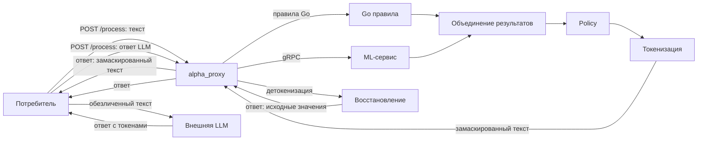

# alpha_proxy

Прокси-сервис для безопасной передачи персональных данных (ПД) во внешние LLM.
Потребитель отправляет текст в alpha_proxy, сервис обнаруживает и маскирует
персональные данные и возвращает замаскированный текст. Потребитель сам
передаёт его во внешнюю LLM, а затем отправляет ответ LLM обратно в alpha_proxy
для детокенизации (восстановления исходных значений). Найденные персональные
данные не передаются открытым текстом во внешнюю LLM.

## Подтверждённые результаты

- **Качество: 9914 из 10000** по метрике качества на официальном стенде
  организаторов.
- **Производительность: порог 1000 RPS** пройден на официальном стенде
  организаторов.

Локальный нагрузочный тест на k6 зависит от характеристик оборудования и от
доли запросов, которые уходят в ML-сервис, поэтому его результаты могут
отличаться от официального стенда.

## Схема системы



## Архитектура

alpha_proxy — это HTTP-контур, который обрабатывает запросы `POST /process`.
Обработка проходит несколько этапов:

1. **Правила Go** — детерминированные правила на Go обнаруживают ПД по
   регулярным выражениям, контрольным суммам и контексту.
2. **ML по gRPC** — Python ML-сервис (`ml-service`) дополнительно находит ПД,
   которые не покрываются правилами. Общение идёт по gRPC на порту `50051`.
3. **Объединение** — результаты правил и ML объединяются, дубликаты и
   пересечения разрешаются.
4. **Policy** — применяются ограничения системы-потребителя: какие типы ПД
   можно маскировать и разрешена ли детокенизация.
5. **Токенизация** — найденные ПД заменяются на токены вида `<KIND_N>`,
   например `<PHONE_1>`.
6. **Детокенизация** — токены в ответе LLM заменяются обратно на исходные
   значения по сохранённому сопоставлению для того же `payload_id`.

alpha_proxy **не вызывает внешнюю LLM сам**: потребитель отправляет текст,
получает замаскированный текст, сам передаёт его во внешнюю LLM, а затем
отправляет ответ LLM обратно для детокенизации.

Сопоставление токенов и исходных значений (mappings) и состояние сессии
хранятся только в памяти и привязаны к `payload_id`. Исходный и замаскированный
тексты целиком не хранятся. TTL сессии — 15 минут; после перезапуска сервиса
активные mappings теряются.

## Быстрый запуск

Запуск всего стека (API + ML-сервис) через Docker Compose:

```sh
docker compose up --build
```

Перед запуском локальные ML-модели должны находиться в `ml-service/models`
(или в каталоге, заданном переменной `MODELS_DIR`). Способ скачивания моделей
зависит от вашего окружения; готового скрипта в репозитории нет.

После запуска API доступен на `http://localhost:8080`.

## Проверка работоспособности

- `GET /healthz` — liveness-проверка: сервис жив.
- `GET /readyz` — readiness-проверка: сервис готов принимать трафик.
- `GET /metrics` — метрики в формате Prometheus.

```sh
curl http://localhost:8080/healthz
curl http://localhost:8080/readyz
curl http://localhost:8080/metrics
```

## POST /process

Основной эндпоинт. Принимает JSON с полями:

| Поле | Тип | Обязательное | Описание |
|---|---|---|---|
| `payload` | string | да | Исходный текст |
| `payload_id` | string | да | Идентификатор сессии для детокенизации |
| `mask_kinds` | array[string] | нет | Ограничение типов ПД для маскирования |

Ответ — JSON с полем `result` (обработанный текст).

В защищённом режиме (`auth_mode=api_key`) запрос должен содержать заголовок
`X-API-Key` с ключом системы. Примеры ниже используют `X-API-Key` для
защищённого режима. Docker Compose по умолчанию запускает API в режиме
`verify` для демонстрации, поэтому в этом режиме ключ не требуется.

```sh
curl -X POST http://localhost:8080/process -H "Content-Type: application/json" \
  -H "X-API-Key: demo-support-key" \
  -d '{"payload": "call 79123456789", "payload_id": "demo-1"}'
```

### Пример маскирования

Запрос:

```json
{
  "payload": "call 79123456789",
  "payload_id": "demo-1"
}
```

Ответ:

```json
{
  "result": "call <PHONE_1>"
}
```

### Пример mask_kinds

Поле `mask_kinds` ограничивает, какие типы ПД маскируются:

- **поле отсутствует** — применяется policy системы (по умолчанию разрешены все
  известные типы, если в конфигурации системы не задано ограничение);
- **пустой массив `[]`** — не маскировать ничего;
- **список типов** — маскировать только перечисленные типы, которые уже
  разрешены policy системы.

Запрос не может расширить права системы: переданные типы действуют только в
пределах того, что разрешено policy системы.

```sh
curl -X POST http://localhost:8080/process -H "Content-Type: application/json" \
  -H "X-API-Key: demo-support-key" \
  -d '{"payload": "call 79123456789", "payload_id": "demo-2", "mask_kinds": ["phone"]}'
```

В этом случае замаскируется только телефон.

Явный пустой массив `mask_kinds: []` означает «не маскировать ничего» — текст
вернётся без изменений:

```sh
curl -X POST http://localhost:8080/process -H "Content-Type: application/json" \
  -H "X-API-Key: demo-support-key" \
  -d '{"payload": "call 79123456789", "payload_id": "demo-3", "mask_kinds": []}'
```

Ответ:

```json
{
  "result": "call 79123456789"
}
```

### Пример детокенизации с тем же payload_id

Детокенизация выполняется тем же запросом `POST /process` с тем же
`payload_id`. Токены в тексте заменяются обратно на исходные значения.
Используется токен из ответа маскирования выше — `<PHONE_1>`.

Пример ответа LLM, который потребитель вставляет в `payload`:

```json
{
  "payload": "Ответ <PHONE_1>",
  "payload_id": "demo-1"
}
```

```sh
curl -X POST http://localhost:8080/process -H "Content-Type: application/json" \
  -H "X-API-Key: demo-support-key" \
  -d '{"payload": "Ответ <PHONE_1>", "payload_id": "demo-1"}'
```

Ответ:

```json
{
  "result": "Ответ 79123456789"
}
```

### Поведение payload_id

- Новый `payload_id` создаёт новую сессию.
- Повтор того же исходного текста с тем же `payload_id` возвращает тот же результат.
- Текст с известным токеном детокенизируется.
- Другой несвязанный текст с тем же `payload_id` считается конфликтом.

### Основные HTTP-ошибки

| Код | Значение |
|---|---|
| `400` | Некорректный JSON, отсутствующие поля, invalid mask kind |
| `401` | Отсутствующий или неверный API-ключ |
| `403` | Отключённая система, policy rejection или запрещённая детокенизация |
| `413` | Превышение body limit |
| `429` | Rate limit или parallel limit |
| `500` | Остальные внутренние ошибки |
| `503` | Явная недоступность Processor или deadline |

## Настройка систем

Системы-потребители настраиваются через JSON-файл, путь к которому задаётся
переменной окружения `ALPHA_PROXY_SYSTEMS_FILE`. Пример — в
`configs/systems.example.json`.

```json
[
  {
    "id": "support",
    "enabled": true,
    "api_key": "demo-support-key",
    "mask_kinds": ["full_name", "phone", "email"],
    "detokenization_allowed": true
  },
  {
    "id": "analytics",
    "enabled": true,
    "api_key": "demo-analytics-key",
    "mask_kinds": ["full_name", "phone", "email", "passport", "card", "inn"],
    "detokenization_allowed": false
  }
]
```

Поля системы:

- `id` — уникальный идентификатор системы.
- `enabled` — включена ли система.
- `api_key` — ключ доступа (передаётся в заголовке `X-API-Key`).
- `mask_kinds` — ограничение типов ПД, которые система может маскировать.
- `detokenization_allowed` — разрешена ли системе детокенизация.

## Поддерживаемые типы ПД

Список типов ПД определён в `internal/pii/types.go`:

- `full_name`, `first_name`, `last_name`, `patronymic` — имя, фамилия, отчество
- `address`, `city`, `street`, `house`, `apartment` — адресные данные
- `place_of_birth`, `citizenship` — место рождения, гражданство
- `passport_issuer`, `cardholder_name` — орган выдачи, имя держателя карты
- `email`, `phone`, `inn` — почта, телефон, ИНН
- `card`, `passport`, `department_code` — карта, паспорт, код подразделения
- `date`, `driver_license` — дата, водительское удостоверение
- `cvv`, `pin`, `postal_code` — CVV, PIN, почтовый индекс

## Безопасность

- Секреты (API-ключи) не хранятся в исходном коде и не логируются; они читаются
  из JSON-файла, путь к которому задаётся переменной окружения.
- Ключи в `configs/systems.example.json` — только демонстрационные. Настоящие
  ключи должны находиться в отдельном некоммитящемся конфиге.
- Контейнеры запускаются в режиме `read_only` с ограничениями памяти, лимитом
  процессов и отключением привилегий.
- В режиме `final` обязательна аутентификация по API-ключу и реальный
  процессор.
- Политика системы ограничивает, какие типы ПД можно маскировать и разрешена
  ли детокенизация.

## Метрики

Метрики доступны на `GET /metrics` в формате Prometheus. Основные метрики
(префикс `alpha_proxy_`):

- `alpha_proxy_http_requests_total` — HTTP-запросы по методу, маршруту и статусу.
- `alpha_proxy_http_request_duration_seconds` — длительность HTTP-запросов.
- `alpha_proxy_http_in_flight_requests` — число запросов в обработке.
- `alpha_proxy_http_timeouts_total` — запросы, завершившиеся по таймауту.
- `alpha_proxy_processor_calls_total` / `alpha_proxy_processor_duration_seconds` — вызовы процессора.
- `alpha_proxy_pii_entities_total` — найденные ПД по типу.
- `alpha_proxy_ml_requests_total` / `alpha_proxy_ml_request_duration_seconds` — запросы к ML.
- `alpha_proxy_cascade_routes_total` — решения каскадной маршрутизации.

RPS и TPS вычисляются из счётчиков через `rate`:

```promql
sum(rate(alpha_proxy_http_requests_total[1m]))
sum(rate(alpha_proxy_processor_calls_total[1m]))
```

### Структурированные логи

Завершение запроса записывается событием `request_completed`. Безопасные поля
события: `request_id`, `method`, `route`, `status`, `duration_ms`,
`error_class`, `consumer_id`, `operation`, `pii_count`, `pii_types`,
`ml_invoked`.

В лог не попадают `payload`, `payload_id`, API-ключ, исходные значения ПД,
токены и `TokenMapping`. Просмотр логов:

```sh
docker compose logs -f api
```

## Команды тестов

```sh
go test ./...
go test -race ./...
go vet ./...
golangci-lint run
git diff --check
```

## Нагрузочное тестирование (k6)

Нагрузочный сценарий находится в `loadtest/k6/process.js`. Он читает датасет из
каталога, заданного переменной `DATA_DIR` (manifest.json, profiles.json,
corpus.jsonl, requests.jsonl), и отправляет запросы на `POST /process`.
Параметры нагрузки задаются переменными окружения (`RPS`, `DURATION`,
`PROFILE` и др.). Результат зависит от оборудования и доли запросов к ML.

Готовая команда запуска (укажите абсолютный путь к датасету):

```sh
docker run --rm --network host -v "$PWD/loadtest/k6:/work/k6:ro" \
  -v "/absolute/path/to/dataset:/data:ro" -e DATA_DIR=/data \
  -e BASE_URL=http://127.0.0.1:8080 -e PROFILE=small -e RPS=1000 \
  -e DURATION=30s grafana/k6:latest run /work/k6/process.js
```

## CI / CD

Непрерывная интеграция запускается на GitHub Actions (`.github/workflows/ci.yml`)
при pull request, push в `main` и вручную. Проверки: Go (модули, `go test -race`,
`go vet`, `go build`), golangci-lint, валидация compose-конфигов и дашборда
Grafana, сборка Docker-образов `api` и `ml`. ML-модели в CI не скачиваются.

После успешного CI в `main` Docker-образы публикуются в GHCR с immutable SHA
tag. Production deploy запускается вручную, выполняет smoke test и поддерживает
rollback. Подробности — в [`deploy/README.md`](deploy/README.md).

## Ограничения

- Сервис не вызывает внешнюю LLM сам: он подготавливает обезличенный текст и
  восстанавливает ответ, а вызов LLM выполняет потребитель.
- Качество детекции зависит от доли запросов, уходящих в ML: правила Go
  покрывают детерминированные случаи, ML — более сложные.
- Локальный результат нагрузочного теста k6 зависит от оборудования и доли
  запросов к ML и может отличаться от официального стенда.
- Детокенизация возможна только для того же `payload_id`, для которого была
  выполнена токенизация, и только если система имеет право на детокенизацию.

## Сценарий демонстрации для жюри

1. Запустите стек: `docker compose up --build`.
2. Проверьте готовность: `curl http://localhost:8080/readyz`.
3. Отправьте текст с ПД и получите замаскированный результат:
   ```sh
   curl -X POST http://localhost:8080/process -H "Content-Type: application/json" \
     -d '{"payload": "call 79123456789", "payload_id": "demo-1"}'
   ```
4. Покажите, что телефон заменён токеном `<PHONE_1>`.
5. Отправьте ответ с токеном и тем же `payload_id`, чтобы показать
   детокенизацию:
   ```sh
   curl -X POST http://localhost:8080/process -H "Content-Type: application/json" \
     -d '{"payload": "Ответ <PHONE_1>", "payload_id": "demo-1"}'
   ```
6. Покажите метрики: `curl http://localhost:8080/metrics`.
7. Продемонстрируйте `mask_kinds`, ограничив маскирование только телефоном.
